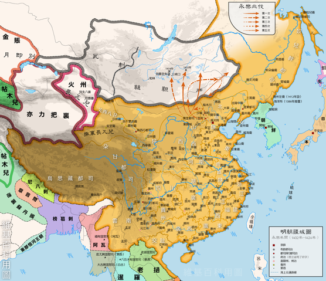

# ヨーロッパより早い中華の大航海を成し遂げた永楽帝について
@nonchalant0303  
2021-09-26

---

# 永楽帝 (1360 ~ 1424)

- 明の第3代皇帝
- 姓は朱、諱は棣
- 永楽は在位中の元号
    - 一世一元の制
    - 君主（皇帝、天皇、国王）1人につき年号（元号）を一つ制定する制度

---

# 生まれ ~ 燕王

- 紅巾の乱で頭角を現した群雄の朱元璋（後の洪武帝）の四男として生まれた
    - 明の高祖
- 記憶力が極めて高く、幼い頃は早朝から学者を招き、一度読んだ本の内容は忘れなかったとされる
- 戦場での能力と勇敢さを洪武帝から認められて、現在の北京にあたる燕の地に封ぜられた (燕王)

---

# 靖難の変 (1399 ~ 1401)

- 皇帝の削藩に対抗して南京に反乱を起こした
- 南京にいた2代目の建文帝を打倒して、3代目の皇帝になる

---

# 皇帝

- 北京に遷都
    - 中華では初
- 前皇帝の臣下を残虐な方法で削除
- 「東廠」と呼ばれる宦官の組織を作り、諜報活動を実施させている
    - 宮中にスパイを配置して、恐怖政治を行う

---

# 中華思想の体現

- モンゴルへの5回の遠征
    - 元の後継である韃靼人(タタール)を威圧
- 朝鮮、琉球、日本からの朝貢
    - 足利義満による勘合貿易など
- ベトナム、チベットの直轄領化
- ラオス、シベリア、樺太などにも出兵
- ティムール朝と敵対していたが、死後は和睦して友好関係を築いた

---

# 鄭和の大航海

- 鄭和に命じ大船団を南海に派遣した
    - 雲南省でムスリムの次男として生まれた
- 全7度行われ、東アフリカ沿岸のマリンディ（現在のケニア）にまでに達した
- 目的は...不明

---

# 第1次航海（1405 - 1407)

- 全長42丈（約131m）余の大船62隻、乗組員総数2万7800名余りからなる大艦隊
- 泉州府 → シュリー・ヴィナーヤ → スラバヤ → パレンバン → マラッカ → アル →サ ムドラ・パサイ王国 → セイロン → コーリコード
- インド西南部のコーリコード (現カリカット）まで到達
- 東南アジアの各国が朝貢するようになる

---

# 第2次航海（1407 - 1409）

- コーリコードまでで帰還

---

# 第3次航海（1409 - 1411）

- コーリコードまでで帰還

---

# 第4次航海（1413 - 1415）

- コーリコード → ホムルズ
- (分隊) スマトラ → モルディブ → モガディシオ → ブラバ → ジューブ → マリンディ

---

# 第5次航海（1417 - 1419）

- コーリコード → ホムルズ
- (分隊) スマトラ → モルディブ → モガディシオ → ブラバ → ジューブ → マリンディ
- ホルムズからライオンやヒョウ、ブラバからダチョウ、モガディシオからシマウマなどを明に持ち帰る
    - 永楽帝はアデンから贈られたキリンがお気に入り
    - 君主が仁政を行うときに現れる瑞獣「麒麟」として紹介されたため

---

# 第6次航海（1421 - 1422）

- コーリコード → ホムルズ
- (分隊) スマトラ → モルディブ → アフリカ東岸 → アデン

---

# 第7次航海（1430 - 1433）

- 永楽帝の死後
- 前回と同様、シュリー・ヴィナーヤ、スラバヤ、パレンバン、マラッカ、サムドラ・パサイに寄港
- イスラム教の聖地メッカにも寄ったらしい

---

# 大航海の結果

- 基本的には平和的な修好と通商を目的とし、到着した土地で軍事行動を起こすことは少なかった
- 航海そのものの経費に限らず、朝貢貿易において明は多額の出費を必要
- 永楽年間以後の明は財政緊縮の観点から朝貢貿易に制限・制約を加え、結果として朝貢国は激減している
    - この後、ヨーロッパの大航海時代が始まる (1415)

---

# 死去

- 1424、モンゴルへの5回目の遠征の帰途で没 (享年65)

---

# 中国の大航海について

- 西洋世界や遊牧民族と異なり、武力で支配せずに朝貢を行なわせて統治を認める形式 (冊封体制)
    - 秦の時代からの中華思想
    - 足利義満が明王朝から「日本国王」として冊封を受ける
- 冊封体制の問題
    - 朝貢より返礼品である回賜のほうが高価であり、規模が広がれば広がるほど明側が損をする仕組み
    - 目上の人が損をするべきという儒教的価値観に基づく
