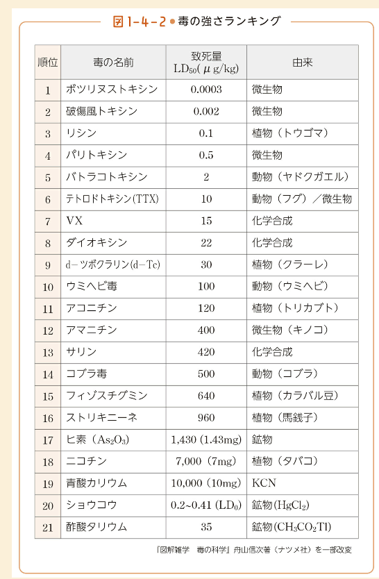
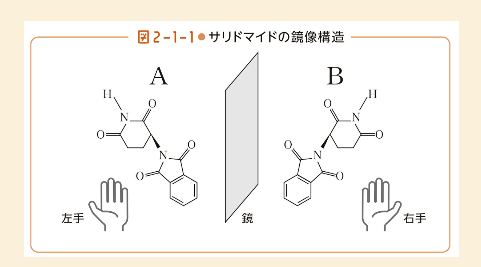
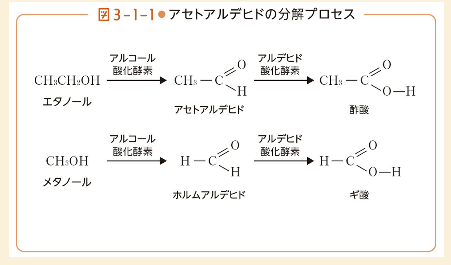
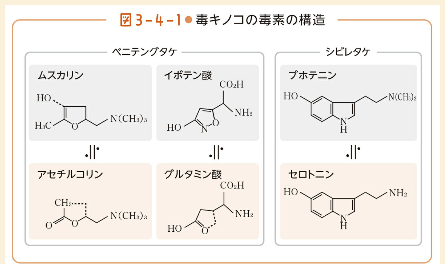

# 毒と薬の歴史

@nishihara

2024/3/17

---

# 参考

- 「毒と薬」のことが一冊でまるごとわかる
  - <https://www.beret.co.jp/book/47094>

---

# 古代の薬（治療）

- 病気の原因は不明で、まじない（呪い）、加持祈祷による治療
  - シャーマン、呪術師
  - 卑弥呼もこのような人物だったという説
- 紀元前2740年に中国の「神農」
  - あらゆる植物を食べ、その植物の薬効を研究し、人々に教えた
- 紀元前460頃～　医学の父　ヒポクラテス
  - 草木や鉱物など、自然界にあるそのままが薬として用いられた

---

# 近代の薬

- 17世紀から18世紀にかけてようやく科学が発展してきた
- 病気の原因を科学的に究明しようという動き
- ジェンナー（1749~1823）による天然痘予防の種痘
- コッホ（1843~1910）による結核菌やコレラ菌の発見
  - 治療不可能と思われていた現象が悪魔や祟りではなく、科学的に説明がつくものに
- 梅毒の治療薬
  - 1910年のサルバルサン
    - 天然の医薬品とは無関係に、純粋に科学の観点だけから開発された薬品
- ペニシリン（抗生物質）
  - 1928年、イギリスのフレミング

---

# 毒の話

---

# 暗殺の手段

- 日本でよく「お家騒動」に使われたのがヒ素
- ヨーロッパではヒ素を検出するために銀の食器が使われた
  - 銀の食器ではヒソは検出（黒くなるといわれていた）はできないが、当時のヒ素は不純物を含んでいて、それが銀と反応して黒くなった

---

# 毒の使い道

- 公に用いられる毒
- 秘密裏に用いられる毒

---

# 毒の使い道１

- 公に用いられる毒物
  - 殺虫剤などの農薬
    - 第二次世界大戦中に死体にわく蛆を駆除するDDTなど
    - 塩素系の殺虫剤は人間にも毒
    - リン系の殺虫剤が比較的新しいが、蜂の帰巣本能を狂わせる懸念
  - 化学兵器（現在禁止）
    - ドイツ軍が用いた毒ガス
    - 地下鉄サリン事件
  - 公害につながった毒
    - 有機水銀による水俣病
    - カドミウムによるイタイイタイ病
    - 硫黄酸化物SOxによる四日市病

---

# 毒の使い道２

- 秘密裏に用いられる毒物
  - ヒ素を用いた暗殺（今では用いられない）
    - ヒ素の検出の技術があがったので、暗殺だとすぐわかる
  - タリウムを使った暗殺
    - 1861年発見された金属。猛毒
  - 放射性物質ポロニウム
    - キュリー夫人が発見（1867~1934）
    - 自然界にはほぼ存在せず、原子炉から取り出す
    - これを使った暗殺が2006年にイギリスであった（被害者は亡命ロシア人）
      - 寿司バーで寿司にポロニウムを振りかけた
      - 内部被ばくにより数日で死亡

---

# 毒とは何か

- 水であっても過剰摂取すれば死ぬ
  - 2007年にアメリカで水飲み大会
    - 7.5Lの水を飲んだ28歳の女性が死亡
- 毒とは、「少量で」人の命を縮めるもの

---

# 毒の強さの指針

- 半数致死量LD50
  - 半数致死量
  - 毒には効き方に個人差があるので、統計的な数値を用いる
  - グラフにするとシグモイド曲線になる

---

# 致死量ランキング

---

# 薬の有効度の指針

- 半数の検体が治癒した摂取量がED50
- 薬も飲みすぎると死ぬ
- ED50の量を飲んだ時に、仮に15％の人が死ぬという場合、それはもはや薬ではない

---

# 薬か毒か

- サリドマイド
  - 1957年ドイツ　グリューネンタール
  - 睡眠導入剤
  - 障害児の誕生の原因となる
  - 1961年に一部の研修者が学会で発表。
    - この学会の10日後にグリューネンタールは販売停止
    - 日本の販売停止はドイツの決定から半年後（1962年9月販売停止）

---

# サリドマイドの原因

- 光学異性体による影響
  - 右手と左手の関係のように、鏡写しになる構造体
  - AとBのどちらかが催眠作用を持ち、反対のほうは催奇形性を持つということ
  - 催眠作用のほうだけ取り出して服用したとしても、数時間経つと、別の属性に変化する（悪魔の薬）

---

# サリドマイドの効用

- 抗がん剤として注目
  - サリドマイドには抗がん作用があった
- 毛細血管の発生を阻害するという特性がある
  - 妊娠初期に胎児の腕が発育する時期にサリドマイドを飲むと、発育不良となる
- 発育途上のがん細胞の毛細血管の発生を阻害できる
- 糖尿病による失明にも効果が
  - 無用の極細の毛細血管が発生し、そこから出血することが失明の原因だが、それにも効用がある

---

# 毒は薬にもなる

---

# 薬害

- 血友病患者のための血液製剤によるC型肝炎
  - 加熱処理をしていなかった血液が原因
- アメリカで1977年に禁止になった血液製剤が、日本では1987年まで使われていた
- 血液製剤はHIVの薬害エイズ事件も引き起こしている

---

# 不老不死の研究

- 中国での仙薬の探求
- 中国皇帝は水銀を飲んでいた
  - 水銀は表面張力が非常に大きく、手のひらの上で玉になって動き回る
  - まるで生きているようだ
  - 中国では水銀に命があると考えた
  - 水銀を400度に熱すると、黒い酸化水銀になるが、さらに500度まで熱すると元の水銀に戻る
    - 生き返った（フェニックス）

---

# 二日酔いのメカニズム

- 酒にはアルコールの一種であるエタノールが含まれている
- メタノールもアルコールの一種だが、毒

- 体の中に入ってきた有機物を酸化して栄養素にしようとする（代謝）
  - アルコールが酸化されてアセトアルデヒドになる（これが毒素がある）
  - アセトアルデヒドは酢酸になる

---

# なぜ毒物で人は死ぬか

---

# 呼吸毒

- 青酸カリ
  - 青酸カリを飲むと、胃の塩酸と反応して青酸ガスが出る
  - 胃まで届かないとガスは発生しない
  - 青酸カリが呼吸を阻害して死に至る
    - ヘモグロビンが酸素を運ぶ能力を青酸イオンが強引に鉄イオンと結合してしまう

---

# 神経毒（フグ）

- フグの毒は神経細胞に作用して命を奪う
- フグ毒のテトドドトキシンは、ニューロンの通信を阻害する
  - 神経伝達ができない→心臓の筋肉も動かせない→死に至る

---

# 神経毒（キノコ）

- 世界中にキノコがどれくらいあるかわかっていない
- 日本だけでも5000種ほどあり、その3分の1は毒キノコ
  - タマゴテングダケ
    - 肝臓、腎臓を破壊して多臓器不全
    - 世界の90％のキノコ中毒がこれ
  - ドクササコ
    - 手足、末端の激痛
  - テングダケ
    - 意識喪失、精神錯乱
- 人間の神経伝達に作用する

---

# 神経毒（キノコ）２

- 体内の正常な物質に間違われて処理される
- 結果、筋肉が緊張しっぱなしになったりする
  - 筋肉の緊張をほぐすコリンエステラーゼの働きを阻害する

---

# 神経毒（サリン）

- サリン、VXなどの化学兵器は、リンを含んでおり、神経系統に作用する神経毒となる
- キノコの神経毒と同じように、筋肉の緊張に作用する。（筋肉の緊張をほぐすコリンエステラーゼの働きを阻害する）
- 筋肉が緊張（収縮）しっぱなしになってしまって死に至る
  - 神経毒系統の農薬を撒くと害虫は死滅しますが、神経をもたない植物には神経毒の農薬は何の作用も無い

---

# サリンの応急薬

- サリンの応急薬のアトロピン
  - ベラドンナ（貴婦人という意味）というナス科の植物の実に含まれる毒物
  - アトロピンを目に挿すと瞳孔を開く作用があるので、眼科などでは医薬品として用います。昔のイタリアでは若い女性が恋人に会いに行くときに、瞳を大きくして魅力的に魅せるのに使った
  - 飲むと猛毒
  - 筋肉の伝達物質の受容部位をブロックしてふさいでしまう
    - 筋肉が緊張しっぱなしになることを防いでくれる（結果としてサリンの毒が抜けるのを待てる）

---

# その他

- 重金属の毒
  - 重金属は体内で蓄積されて、閾値を超えたら発病する
- 放射線の毒
  - 放射線が人間の身体に突入すると、そのエネルギーで身体を作る分子が破壊される
    - 破壊の連鎖
  - DNAやRNAなども破壊し、がん細胞や異常細胞が生み出される
