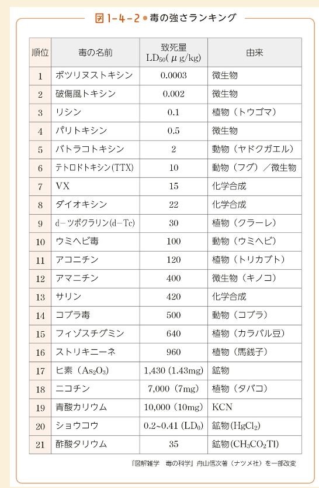

# 毒と薬の歴史2

@nishihara

2024/5/18

---

# 参考

- 「毒と薬」のことが一冊でまるごとわかる
  - <https://www.beret.co.jp/book/47094>

---

# 致死量ランキング

---

# 毒物の恩恵

- 毒物がなくなったら困るケースもある
  - 殺虫剤など
- かつては狩猟時に矢毒を用いた

---

# 毒の文化圏

日本は4のトリカブト（アイヌなど）

---

# 日本の最大毒植物

- トリカブト（ぶす）
  - アコニチン（神経毒）
  - 漢方薬で強心剤として用いられる
- ドクゼリ
  - 食用セリと間違って中毒するケースが多い
- ドクウツギ

---

# 草本類１

- ダチュラ（朝鮮アサガオ）
  - 花岡青洲が麻酔として用いた
- ヒガンバナ（曼殊沙華）
  - 種をつけないので、人間が意識的に植えないと繁殖しない
  - あぜ道、墓に多いのは動物避け（モグラとか）
  - 飢饉のときには最終手段として食べたらしい
- スズラン
  - 主に心臓関連の症状

---

# 草本類２

- ドクニンジン
  - ソクラテスの処刑に使われた。北海道に一部自生
  - 関節炎や様々な難病の治療に用いられてきた
- ワラビ
  - 実は猛毒（および強い発がん性）
  - あく抜きをすれば食べれる

---

# 本木類

- トウゴマ
  - ひまし油がとれる（加熱すると無毒）
- キョウチクトウ
  - 街路樹によくある。猛毒
- イチイ
  - 赤い実が猛毒
- 樒（シキミ）
  - 植物全体が毒性
  - お墓に供えられる。
- ドクウツギ
  - 植物全体が猛毒。
  - 果実は熟すと甘い。戦前は食中毒の１０％を占めるほど

---

# キノコ

- カエンダケ
- ドクツルタケ、タマゴテングタケ、シロタマゴテングタケ
  - 毒キノコ御三家
- ニガクリタケ
  - 毒の構造はわかっていない
- スギヒラタケ
  - 2004年秋から毒キノコとして認知。今まで中毒していた人もいただろうが気づかなかった
  - 原因不明
- どくささこ
  - 潜伏期間不明。食べると激痛らしい・・・怖い
- ヒトヨタケ
  - アセトアルデヒドの分解を阻害する。ずっと続く二日酔い

---

# 毒をもつ哺乳類

- かつては毒をもつ哺乳類はいないとされていた
- カモノハシ
  - 蹴爪に毒（オスのみ）
- トガリネズミ
  - 唾液に毒。構造不明
- スローロリス
  - 毒を分泌し、唾液とまぜて毒になる。弱毒

---

# 毒蛇

- 毒蛇の毒はすべてタンパク質
- 神経毒と、出血毒（筋肉を壊死させる）がある
- 神経毒は神経に対して作用するので穏やか。痛みはそれほどない
- 出血毒は筋肉に作用するので強い痛みがある

---

# 毒ガエル

- ガマガエル
- ヤドクガエル
  - 矢毒に用いるほどの強毒。（神経毒）
  - 生物が持つ毒では、パリトキシンについで強い

---

# 魚介類の毒

- 自分で毒を作るものと、食物連鎖の毒を濃縮したものがある
- フグ
  - 紅藻類の作ったものを食物連鎖で体内に蓄積
  - 天然のエサを取らない養殖フグは無毒らしい
  - 養殖フグに天然フグを入れたら毒を持つ。（テトロドトキシンを生成できるという説）
- イモガイ
  - 種類が多く、500種類にのぼるといわれている
  - イモガイの毒は複数（場合によっては100種以上）から構成される
  - 多くは未知の構造で、研究が進めば薬になる可能性がある。

---

# 金属の毒

- 水銀
  - 水俣病
- カドミウム
  - イタイイタイ病（骨粗しょう症）
- 鉛
  - 昔はおしろい、ハンダに使われた
  - ベートーベンの難聴は鉛中毒という説もある（ワインに鉛混ぜて飲む文化があった）
  - ローマ皇帝ネロも鉛中毒説。（ワインを鉛鍋で飲んでいた）

---

# 化学兵器としての毒

- 最初は古代ギリシャで用いられた硫黄を燃やした気体
- 現代ではドイツ軍が1915年にベルギーで使った塩素ガス
- フランスも第一次世界大戦（1916年）にホスゲンを使用
  - ホスゲンはアウシュビッツで使われたことでも有名

---

# 薬物

- 薬物は神経細胞に作用する化学物質で、神経毒の一種といえる
- 薬物は、耐性と離脱症状がある点
  - 耐性
    - 快楽を得るために必要な麻薬の量が増えていく
  - 離脱症状
    - いわゆる禁断症状

---

# 麻薬と覚せい剤

- 脳に耐性と離脱症状を与えるのは麻薬と覚せい剤の2種類
  - あまり明確な定義があるわけではない
- 麻薬
  - 摂取すると恍惚状態に入り、現実と夢が区別つかなくなる物質
- 覚せい剤
  - 摂取すると頭が冴えわたり、疲労感を忘れ、恐怖感も感じなくなるもの
  - 第2次世界大戦時には戦地で使われた

---

# アヘン

- アヘン
  - アヘン戦争
    - 英国と中国の戦争（1840~1842）
    - 絹や紅茶を英国が多く仕入れて、その代金をインドのアヘンで支払おうとして中国ともめた
- アヘンの亜流がヘロイン
  - ヘロインは麻薬効果が非常に強く、麻薬の女王と呼ばれる
  - ヘロインは強い鎮痛作用も持つ（モルヒネの数倍）が、習慣性が現れるので医療には使われない

---

# コカイン

- コカインは覚せい剤の作用（アンフェタミン類）と類似している
- コカインは依存性はかなり強いが、主に精神的依存で、肉体的依存ではない

---

# 覚せい剤

- 頭がさえて元気が出る。覚醒することからつけられた名前
- 覚せい剤の主なものはメタンフェタミン、アンフェタミン
- 日本人が開発した
  - 長井長義（1845~1929）
  - メタンフェタミンを1893に合成。アンフェタミンはルーマニア人。
- ヒロポン
  - 疲労がポンと飛ぶという意味という由来を聞くが、実はギリシア語のヒロポノス（労働を愛する）

---

# 大麻、LSD

- 大麻
  - 大麻は麻とも呼ばれ、植物繊維の原料として昔から栽培されてきた
  - マリファナ
    - 覚醒作用がある。精神的に高揚する
    - 大麻はタバコより害が少ないので認められている国もある
- LSD
  - 麦角菌の出す毒素を化学合成しようとしているときに偶然できたのがLSD
  - 幻覚作用がある
  - ヒッピーが好んだ

---

# その他

- MDMA
