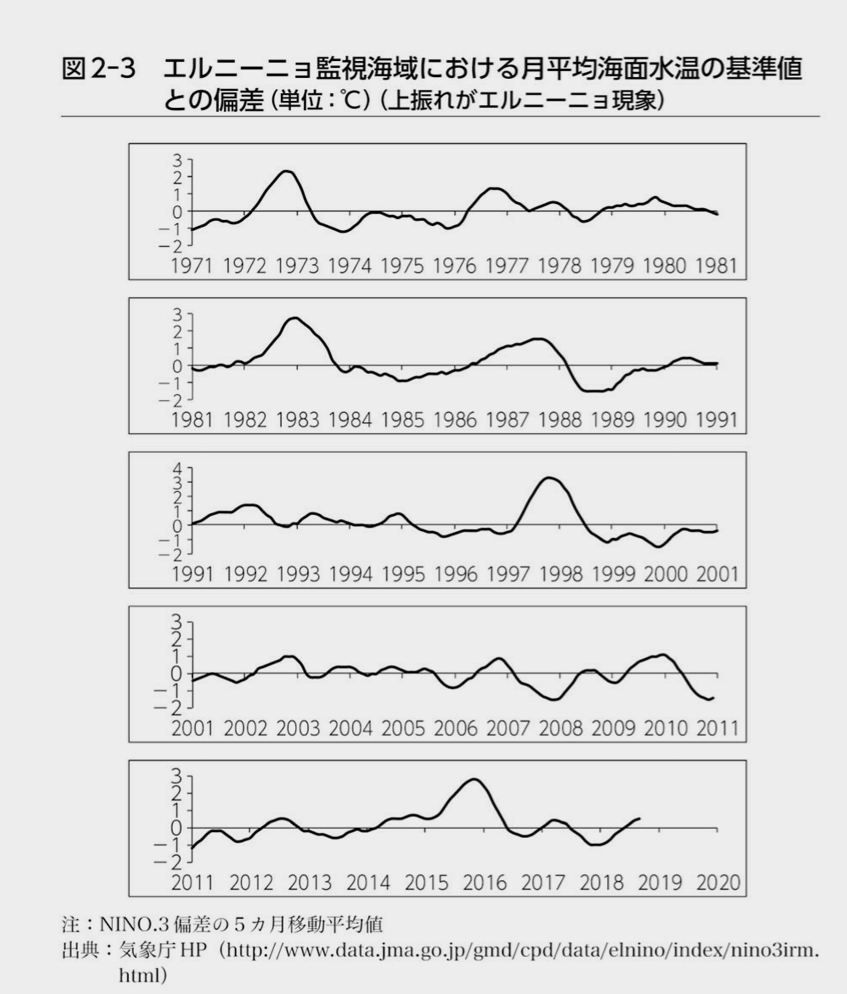

# 気候の歴史 2

2025/9/28

---

# 参考

- 気候文明史 世界を変えた8万年の攻防 (日本経済新聞出版)
  - <https://www.amazon.co.jp/gp/product/B07TC2PHLV>

---

# ハドレー循環

- 熱帯収束帯
  - 赤道を中心に、積乱雲が地球を一周するする帯のように連なっている地域
  - 赤道を横切って南北に飛行機で移動する際に、積乱雲に注意する地域
- 熱帯収束帯での上昇気流によって上空に達した空気は、北半球では極側に北上し、緯度にして二〇度から三〇度の極側で暖かく乾燥した空気として上空から地上に降りてくる
  - この循環をハドレー循環と呼ぶ
- ハドレー循環は亜熱帯の一部地域を乾燥させる効果を持っている
  - サハラは、ハドレー循環の中で上空にある空気が下降流として降りてくる地域にあたるため、暑く乾燥し砂漠が広がっている。
- その他、アフリカ南部のカラハリ砂漠、オーストラリアの砂漠も、南半球のハドレー循環によるもの

---

# 現代人

- 13000年ほど前
- やわらかい食事をするために顎と歯が小さくなり、脳容量が減少
- 農耕が開始されてから身長が低くなる
  - 現代は食事が見直され、体格が著しく改善している
    - 完新世の気候最適期と同じレベルに戻った
    - 生物学的にこれ以上体格が縦に伸びることはない
- 男女の関係
  - 女性の場合、地域的にみて一様にばらついているのに対し、男性は相対的にみて地域的な特色が
    - つまり、女性が自らの集団を出て、男性の集団に加わる、という家族の在り方

---

# 現代人

- 寿命
  - 農業による安定した食糧確保が可能になったことで、寿命が延びたと思いがちだが、そうではなかった。
  - 女性の場合、移動の負担や危険から解放されたことでいつでも子供を作れるようになり、妊娠頻度が上昇したため、妊娠と育児のためかえって寿命が短くなってしまった。

---

# 日本

- 13000年前
  - 日本列島の場合、ヨーロッパや北米大陸のような巨大氷床がなかったため、気候の温暖化は三〇〇〇年近く早く始まった。現在発見されている世界最古の土器は、長崎県北松浦郡の遺跡で発掘された隆起線文系土器
  - 土器の生産の開始が早かったのは、温暖化がユーラシア大陸や北米大陸に比べて先行したことが要因かもしれない。
- 最終氷期最寒冷期の間、海面水位が低下していた
- 一万年前以降に日本列島が大陸から分離すると、縄文人は孤立

---

# ノア

- ノアの洪水はあったのか？
- ノアが600歳誕生日の「2月17日」から40日40夜降り続く
- 世界中に洪水伝説はあり、この洪水が実在したとする学者も多い。
  - ギルガメシュ叙事詩

---

# アイスマン

- 一九九一年九月一九日、一般登山者がイタリアとオーストリア国境沿いのエッツイ谷の氷河の中に茶褐色の後頭部が突き出した遺体を発見
- 遭難者を発見と報告
  - ラインホルト・メスナーふくめて調査に向かい、最古の遭難者を発見
  - アイスマン
  - 5300年前に氷河に滑落した中年男性
- アルプスの氷河が発達する前に氷河におちた
- 最近の温暖化の影響により氷河が縮小し、発見

---

# エルニーニョ

- エルニーニョとは数年おきにペルー沖の海水温度が上昇する現象
- ペルーの漁師の間で知られていた
  - 毎年一二月頃になると、赤道直下の太平洋東部の海面水温が高くなってペルー沿岸に暖流が流れこむため、翌年三月までのアンチョビの漁獲がなくなる。
  - ところが数年に一度、極端に海面水温が上昇すると、三月を過ぎてもペルー沖への暖流の流れが変わらないためアンチョビは深刻な不漁となる。
  - 暖流がペルー沖に来る時期が一二月下旬であることから、不漁の年はその季節に現れた子供（イエス・キリスト）にちなんで「神の男の子」エルニーニョと名づけられた。

---

# エルニーニョ

- ギルバート・ウォーカー（一八六八－一九五八）　英国
  - インドの南西モンスーンの研究をしていた（数年に1回極端に干ばつすることがあるので、その原因調査）
  - 世界中の気圧の高低について研究をつづけた
- ヤコブ・ビャークネス（一八九七－一九七五）　ノルウェー
  - 天気図でおなじみの温帯低気圧や前線の考え方を発見した人
  - エルニーニョは南米限定の気候現象ではなく、地球規模での深刻な干ばつや洪水を引き起こすものという仮説を提唱
    - エルニーニョ南方振動（ＥＮＳＯ：El Nino Southern Oscillation）
- 一九七二年から七三年に突如として全世界を襲った深刻な干ばつ
  - 食糧安保という概念が生まれるきっかけ
  - エルニーニョが気象学をこえて、政治や経済にまで関心を集める

---

# エルニーニョ

- 二十世紀以降の地球温暖化と必ずしも関係しているわけではない

---

# サハラ

- しかし、九〇〇〇年前から八〇〇〇年前にかけて、地中海沿岸からの移住が活発化し、狩猟採集を基本としつつ、食糧を安定化させるためにヒツジの牧畜
- 五五〇〇年前頃を過ぎると気候は急激に変わった。北大西洋の海底コアには、サハラから風により運ばれた塵が含まれている。
- 熱帯収束帯の北端は赤道側に移動
- ハドレー循環により乾燥
- 二十世紀以降のサハラ砂漠の拡大については、地球温暖化の影響というよりも、砂漠地帯の南側の草原地帯サヘルで牧畜民の人口が増加し、それにともなって数が増したヤギやヒツジが若芽も含めて草原地帯の植物を食べ尽くしていることが大きな原因と考えられる。

---

# 集団生活

- エジプトやメソポタミア文明が勃興し、集団生活が開始
  - 家畜
    - 伝染病の原因（イヌ、ヤギ、ヒツジなど）
    - アメリカ大陸では、ラマ、アルパカしか家畜化していなかったので、欧州からの伝染病に対する免疫力がなかった
      - アメリカ大陸の先住民族の減少は、欧州からの鉄砲による虐殺ではなく、持ち込まれた疫病による
  - 農業
    - 食べる食物が限定され、著しい栄養バランスの偏り
- 戦争の起源
  - 土地の争い

---

# ３つの寒冷期

- 4200年前、3500年前、2800年前にそれぞれ3つの寒冷期が始まる
  - 寒冷期と人類史には大きな影響がある

---

# 人類史と気候

- 四二〇〇年前から四〇〇〇年前にかけて、メソポタミアのシュメール文明を滅亡させ、エジプトで古王国から第一中間期とよばれる混乱が起きた背景
  - 気候変動があり、干ばつ。
  - 灌漑用水の利権や穀物などをめぐって戦争激化
  - 古代エジプト
    - ファラオが洪水を管理しているという世界線
    - ナイル川のコントロールがファラオの権威の象徴（魔法のような力が使える存在）
      - 毎年洪水を発生させ、その時期を国民に知らせて権威を得る
    - 実際には天体観測による暦の観測で洪水の時期を予測していた
  - 4200年前の頃の干ばつでは、ファラオの予言通りに洪水が出なかった
    - 深刻な飢饉
    - ファラオの神性を脅かす事態に

---

# 食の禁忌

- 食材の禁忌
  - 豚
    - 南西アジアから禁忌に。
    - 豚は日焼けするため日陰で飼育する必要、乗れない、乳を作れない、豚コレラ、せん毛虫、などの理由から家畜化されなくなる
    - 気候変動があっての禁忌化
      - 乾燥化していくなかで、メソポタミアやエジプトでは豚を飼いにくくなった（日陰で飼育する必要がある）
      - 結果として好まれなくなり、家畜として減っていく
- 3000年前ごろまで、北インドで牛肉は食用とされていた
  - 牛を飼育するのはコストが高い（人間の食糧を奪い合ってしまう）ため、牛肉のコストが上昇し、牛は農耕用で食用ではなくなった

---

# 多くの文明の変遷

- 三二〇〇年前から三〇〇〇年前の間、ミケーネ文明やヒッタイトが崩壊し、東アジアでは殷から周への王朝交代が起きたきっかけ

---

# ミケーネ文明の崩壊

- 3700年前にサントリーニ島の大噴火
  - 20世紀最大の噴火である1991年のピナトゥボ火山の９倍相当（巨大カルデラの形成）
  - クレタ島には巨大津波により町が消滅
  - ミノア文明が衰退し、その後クレタ島をミケーネ系ギリシャ人が支配するようになり、文化や宗教が変わる
  - クレタ島で用いられていた線文字Aから線文字B（のちにギリシャ語につながる）文字へと変化をする。
    - 線文字Aは未解読
- 3300年前あたりから地中海から南西アジアにかけて気候が変化
  - 乾燥化傾向（可罰発生により不作）。都市部では人口を維持できず、地方化が進む

---

# ミケーネ文明の崩壊

- 3200年前にトロイア戦争勃発（木馬）（ギリシャVSトロイア）
  - 戦争の後に飢饉と伝染病があり、多くの土地ですめなくなった（結果はギリシャの勝利）
- 3200年前頃、ミケーネ文明の拠点のミケーネ、ティリンス、ぴゅろすで宮殿や城塞が炎上、都市の放棄
  - ドーリア人の侵攻によりほろんだという説が根強かったが、近年では深刻な干ばつによる影響という説が強い
- 崩壊したミケーネ文明の跡地にドーリア人が入植
  - ドーリア人が森林伐採後の荒れ地にオリーブを植えて、今日の文明につながる

---

# ヒッタイト滅亡

- 紀元前1274年　ヒッタイトVSエジプト（カデシュの戦い）
  - 鉄の精製を発明したヒッタイトは軍事国家だったが、食物を輸入に頼っており、干ばつにより苦しくなり、南進して戦争。
  - 世界最古の大戦争
    - ヒッタイト兵士4万、エジプト兵士2万
  - 引き分け（両国ともに、自国の石碑には勝利したと書いた）
- 世界最古の講和条約を結ぶ（戦後10年後）
  - 犯罪者引き渡し条約のような事項も含まれている
- ヒッタイトの食糧不足は深刻で、その後内乱が勃発
  - 謎の民族「海の民」に責め立てられ、ヒッタイトは紀元前1190滅亡

---

# 周の勃興、殷の滅亡

- 3200年前ごろに黄河上流の黄土高原で気候の乾燥化
  - 黄土高原では農業牧畜が困難になり、黄河中流に移動
- 気候異変は黄河中流から下流におよび、渇水、干ばつ、飢饉など
- 3050年ごろに殷が滅亡
- 新たに王朝を築いたのは、黄土高原出身の民族（周）

---

# 二八〇〇年前の寒冷化を契機にした民族の大移動

- アジア
  - 周の国政が混乱し、春秋戦国時代に
- 中央アジアの遊牧民
  - 干ばつにより生活苦になり、東西に進出。
  - ウマを使う文化が2800年前ごろに中国に持ち込まれた
- ヨーロッパ北部
  - スカンジナビア半島やユトランド半島を拠点としていたゲルマン系民族が南部やバルト海沿いに西部に移動
- ローマ人がゲルマン人に会う
  - 紀元前102年にマルセイユ近郊まで南下してきたゲルマン人と衝突
